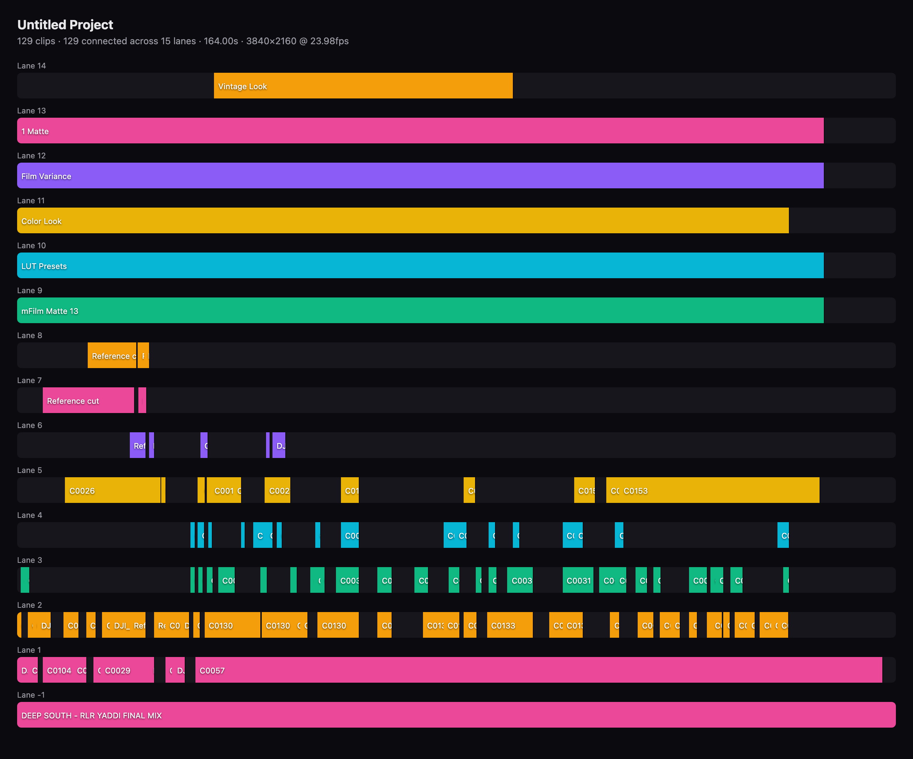

# FCPXML MCP

**The bridge between Final Cut Pro and AI. 13 grouped tools (88 underlying operations) that turn timeline XML into structured data Claude can read, edit, generate, SEE, find — and undo.**

[](https://github.com/DareDev256/fcp-mcp-server/actions)
[](https://opensource.org/licenses/MIT)
[](https://www.python.org/downloads/)
[](https://modelcontextprotocol.io/)
[](https://www.apple.com/final-cut-pro/)
[](https://pypi.org/project/fcp-mcp-server/)
[](https://getlulu.dev/mcps/fcpxml-mcp-server)

**Hardened for real libraries:** 182 adversarial-input security tests, `defusedxml` everywhere, sandboxed writes, no patched binaries, no private APIs — plus a [private disclosure channel](SECURITY.md) with externally reported fixes already credited and merged.


*Real v0.21.2 output, start to finish: three shots cut into a timeline from an
`edl.json`, analysed, drawn as an ASCII timeline, probed for dead air in the
source audio, trimmed, redrawn, and rendered to a proxy whose duration is read
back off the artifact. Recorded from [`demo/demo.py`](demo/demo.py) with
[`vhs`](https://github.com/charmbracelet/vhs) — every line is output from the
same handlers an MCP client calls, so the GIF cannot drift from the code.
Re-record it with `vhs demo/demo.tape`; the media is synthesised by ffmpeg at
run time, so there is no fixture to keep.*

---

## Why This Exists

After a decade directing music videos (Chief Keef, Migos, Masicka), I noticed the same editing bottlenecks on every project: counting cuts manually, extracting chapter markers one by one, hunting flash frames by scrubbing, building rough cuts clip by clip.

These are batch operations that don't need visual feedback. Export the XML, let Claude handle the tedium, import the result. That's the entire philosophy.

---

## See It In Action

```
You:    "Run a health check on my wedding edit"

Claude: ✓ Analyzed WeddingFinal.fcpxml
        ├─ 247 clips · 42:18 total · 24fps · 1920×1080
        ├─ 3 flash frames detected (clips 44, 112, 198)
        ├─ 2 unintentional gaps at 12:04 and 31:47
        ├─ 14 duplicate source clips
        └─ Health score: 72/100

You:    "Fix the flash frames and gaps, then add chapter markers from
         this transcript"

Claude: ✓ Extended adjacent clips to cover 3 flash frames
        ✓ Filled 2 gaps by extending previous clips
        ✓ Added 18 chapter markers from transcript
        → Saved: WeddingFinal_modified.fcpxml
```

Import the modified XML back into Final Cut Pro. Every change is non-destructive — your original file is never touched.

---

## What Claude Actually Sees

This is the magic trick. When you export XML from Final Cut Pro, your timeline becomes structured data that Claude can reason about:

```xml
<!-- What FCP exports -->
<asset-clip ref="r2" offset="342/24s" name="Interview_A"
            start="120s" duration="720/24s" format="r1">
    <marker start="48/24s" duration="1/24s" value="Key quote"/>
    <keyword start="0s" duration="720/24s" value="Interview"/>
</asset-clip>
```

```python
# What Claude works with (after parsing)
Clip(
    name="Interview_A",
    offset=TimeValue(342, 24),   # timeline position: 14.25s
    start=TimeValue(120, 1),     # source in-point: 2:00
    duration=TimeValue(720, 24), # 30 seconds
    markers=[Marker(value="Key quote", start=TimeValue(48, 24))],
    keywords=["Interview"]
)
```

Every time value stays as a rational fraction — `720/24s`, not `30.0` — so trim, split, and speed operations have **zero rounding error** across any frame rate, including the NTSC-fractional ones. A broadcast rate is carried as the exact rational it is (23.976 is `24000/1001`, not a decimal), never as a truncated integer. Comparisons use cross-multiplication (`a/b < c/d` → `a*d < c*b`) to stay in integer-land end to end. Denominators are always normalized to positive values at construction, so sign lives on the numerator and cross-multiplication is always correct. Addition and subtraction share a single `_binop()` code path that handles same-denominator fast paths and LCM alignment in one place.

---

## How It Works

```
  ┌──────────┐      ┌──────────────────────────────┐      ┌──────────┐
  │ Final Cut│      │  parser.py   → Python objects │      │ Final Cut│
  │   Pro    │─XML─>│  writer.py   → Modify & save  │─XML─>│   Pro    │
  │          │      │  rough_cut.py→ Generate new   │      │          │
  └──────────┘      │  diff.py     → Compare        │      └──────────┘
                    │  export.py   → Resolve / FCP7 │
                    └──────────────────────────────┘
                              ▲
                     Claude Desktop / MCP client
```

1. **Export from FCP** — `File → Export XML...`
2. **Ask Claude** — analyze, edit, generate, QC, export
3. **Import back** — `File → Import → XML`

### What This Is NOT

- **Not a plugin** — it doesn't run inside Final Cut Pro
- **Not for creative calls** — color, framing, motion still need your eyes

> **New in v0.9 — Live Mode.** The server can now *push* an FCPXML straight
> into the running Final Cut Pro with zero clicks, using Apple's official Open
> Document event — no XML re-import step. See [Live Mode](#live-mode-macos) below.

---

## Live Mode (macOS)

XML mode is offline and portable; **Live mode** drives a running Final Cut Pro
through Apple's sanctioned surfaces — no patched binary, no private APIs, no
accessibility scripting. Two tools, both verified end-to-end against FCP 12.2:

| Tool | What it does |
|------|--------------|
| **`push_to_fcp`** | Sends an FCPXML file into FCP with zero clicks (Open Document Apple event). Injects `<import-options>` (library location, copy/link assets, suppress warnings), launches FCP if needed, and never mutates your original — flat files get an options-injected copy. |
| **`list_fcp_libraries`** | Enumerates FCP's open libraries → events → projects via the read-only AppleScript dictionary. |

```
You:    "Build a rough cut from my Interview clips and push it into Final Cut"

Claude: ✓ Generated RoughCut.fcpxml (8 clips, 0:54)
        ✓ Pushed into Final Cut Pro → library "ProjectX", event 2026-06-11
        → Open Final Cut Pro to keep editing
```

**The asymmetry you must know:** Apple makes *import* scriptable but offers **no
programmatic export** — to pull your current timeline back out for further AI
work, you still run `File > Export XML` yourself. Live mode pushes; round-trips
come back through the XML tools.

Notes (all live-verified): pass a `library_location` ending in `.fcpbundle` for
a true zero-click import (a new path is auto-created); omitting it makes FCP
show a modal library picker that blocks until you answer. First use triggers a
one-time macOS Automation permission prompt for your terminal/MCP host. The
[capability audit](docs/CAPABILITY-AUDIT-2026-06.md) maps the full surface and
the optional SpliceKit/CommandPost bridges planned for v1.0.

---

## The Round Trip

Final Cut Pro has a fully scriptable **import** and **no programmatic export** —
verified unchanged across FCP 11.0 → 12.2. So the loop closes on exactly one
keystroke, and everything either side of it is automated:

```
watch_start                    ← once per session (or set FCP_WATCH_DIR)
   ↓
edit / generate / mark         ← the change
   ↓
preview_check                  ← SEE it. Reads the media, not the XML
   ↓
deliver.push_to_fcp            ← zero-click import (or FCP_MCP_AUTOPUSH=1)
   ↓
Cmd-E in Final Cut Pro         ← the one manual step Apple leaves you
   ↓
watch_pull                     ← detected and diffed against the last export
```

**`preview_check` is the part that matters.** The `preview://` resource and
`preview_timeline` both draw from the XML — they show what was *written*, so a
fixed flash frame and a broken one read identically through them. `preview_check`
samples the source media into a filmstrip over an audio waveform. It is the
difference between a tool reporting success and you knowing the cut is right.

If you have SpliceKit or CommandPost installed, `watch_start` says so. This
server **does not call either one** — their RPC signatures have not been verified
against a live install, and it never patches or injects anything. That is why it
runs on a managed Mac and survives an FCP update.

---

## Quick Start

### Claude Code (fastest)

```bash
claude mcp add fcpxml -e FCP_PROJECTS_DIR=~/Movies -- uvx fcp-mcp-server
```

Or project-scoped — commit a `.mcp.json` so your whole team gets it:

```json
{
  "mcpServers": {
    "fcpxml": {
      "command": "uvx",
      "args": ["fcp-mcp-server"],
      "env": { "FCP_PROJECTS_DIR": "/Users/you/Movies" }
    }
  }
}
```

With media intelligence (beat detection) and transcript editing (local Whisper):

```bash
claude mcp add fcpxml -e FCP_PROJECTS_DIR=~/Movies -- uvx --from "fcp-mcp-server[intelligence,transcribe]" fcp-mcp-server
```

### Claude Desktop

Add to `~/Library/Application Support/Claude/claude_desktop_config.json`:

```json
{
  "mcpServers": {
    "fcpxml": {
      "command": "uvx",
      "args": ["fcp-mcp-server"],
      "env": { "FCP_PROJECTS_DIR": "/Users/you/Movies" }
    }
  }
}
```

### From source (contributors)

```bash
git clone https://github.com/DareDev256/fcp-mcp-server.git
cd fcp-mcp-server
pip install -e .
# then point your MCP client at: python /path/to/fcp-mcp-server/server.py
```

### Use It

Export XML from Final Cut Pro (`File → Export XML…`), open your MCP client, and ask it to work with your timeline.

---

## When To Use This

| Good For | Not Ideal For |
|----------|---------------|
| Batch marker insertion (100 chapters from a transcript) | Fine-tuning cuts (faster directly in FCP) |
| QC before delivery (flash frames, gaps, duplicates) | Colour, framing and motion (nothing here grades) |
| Data extraction (EDL, CSV, chapter markers) | Sound mixing beyond stems and role splits |
| Template generation (rough cuts from tagged clips) | Anything needing a scrub through the actual cut |
| Automated assembly (montages from keywords + pacing) | |
| Timeline health checks (validation, stats, scoring) | |
| Logging and search before the edit (scenes, transcript, shot search) | |

---

## How It Compares

Three projects have connected AI agents to Final Cut Pro. They make different trade-offs:

| | **FCPXML MCP** (this) | [SpliceKit](https://github.com/elliotttate/SpliceKit) | [CommandPost](https://commandpost.fcp.cafe/) |
|---|---|---|---|
| Approach | Parses/writes FCPXML + official Apple events only | Patches FCP's binary to expose internal APIs | Accessibility scripting + Lua |
| Raw live control | Push-to-FCP, library inspection | Deepest (full internal API) | Deep (UI-level) |
| Survives FCP updates | **Yes — no patching** | Re-patch per FCP version | Mostly |
| Works on managed/corporate Macs | **Yes** | No (requires binary patching) | Varies (Accessibility perms) |
| Works without FCP installed | **Yes** (pure XML mode) | No | No |
| MCP server | **Yes, active** (this repo) | Yes (last release Apr 2026) | Planned, [PR unmerged](https://github.com/CommandPost/CommandPost/pull/3514) |
| Requires | Python 3.10+ | Patched FCP binary | CommandPost app |

SpliceKit's runtime depth is genuinely impressive — if you're on your own Mac and comfortable patching FCP, it can do things XML never will. This project stays on the no-patch side so it runs anywhere, survives every FCP update, and can be trusted with client libraries. Full ecosystem analysis: [capability audit](docs/CAPABILITY-AUDIT-2026-06.md).

---

## Prompt Cookbook

Copy-paste these into Claude Desktop. Each one maps to a real tool chain under the hood.

**Analysis**
```
"Give me a full breakdown of ProjectX.fcpxml — clips, duration, frame rate, markers, everything"
"Show me pacing analysis for my timeline — where are the slow sections?"
"Export an EDL and CSV of all clips with timecodes"
```

**QC & Fixes**
```
"Run a health check on my timeline and fix anything under 2 frames"
"Find all gaps and flash frames, then auto-fix them"
"Are there any duplicate source clips I can consolidate?"
```

**Markers & Chapters**
```
"Add chapter markers from this transcript: [paste transcript]"
"Import markers from my-subtitles.srt onto the timeline"
"List all markers and export them as YouTube chapter timestamps"
```

**Generation**
```
"Build a 60-second rough cut from clips tagged 'Interview' — medium pacing"
"Generate a montage from all B-roll clips with accelerating pacing"
"Create an A/B roll: Interview_A as primary, B-roll cuts every 8 seconds"
```

**Cross-NLE & Reformat**
```
"Export this timeline for DaVinci Resolve"
"Convert to FCP7 XML so I can open it in Premiere"
"Reformat my 16:9 timeline to 9:16 for Instagram Reels"
```

### Under the Hood

When you say *"Run a health check on my wedding edit"*, Claude chains these tools:

```
analyze_timeline  →  stats, frame rate, resolution
detect_flash_frames  →  clips under threshold duration
detect_gaps  →  unintentional silence/black
detect_duplicates  →  repeated source media
validate_timeline  →  structural health score (0-100)
```

Each tool returns structured text that Claude synthesizes into the summary you see. No magic — just batch XML queries that would take 20 minutes by hand.

### Music videos and connected clips

A music video is usually built by laying an audio bed and hanging every visual
off it as a connected clip, so the spine holds one `<gap>` and the entire edit
lives on lanes. `snap_to_beats` and `detect_flash_frames` work on that shape:
snapping runs lane by lane, does not ripple the clips after the one it moves,
skips (and names) any move that would collide with a neighbour in the same
lane, and leaves the audio bed alone unless you pass `include_audio_lanes`.
It reports cuts considered, moved, already on a beat, out of reach, and
skipped — so "nothing moved" is something you are told rather than something
you discover in Final Cut.

`reorder_clips`, `rapid_trim`, `fix_flash_frames` and `fill_gaps` are still
primary-storyline only.

---

## Pre-Built Prompts

Select these from Claude's prompt menu (⌘/) — they chain multiple tools automatically.

| Prompt | What It Does | Grouped calls it drives |
|--------|-------------|-------------------------|
| **qc-check** | Full quality control — flash frames, gaps, duplicates, health score | `diagnose` → `validate_timeline`, `detect_flash_frames`, `detect_gaps`, `detect_duplicates`; then `edit` → `fix_flash_frames`, `fill_gaps` |
| **youtube-chapters** | Extract chapter markers formatted for YouTube descriptions | `inspect` → `list_markers`, `analyze_pacing` |
| **rough-cut** | Guided rough cut — shows clips, suggests structure, generates | `inspect` → `list_library_clips`, `list_keywords`; then `generate` → `auto_rough_cut` |
| **timeline-summary** | Quick overview — stats, pacing, keywords, markers, assessment | `inspect` → `analyze_timeline`, `analyze_pacing`, `list_keywords`, `list_markers` |
| **cleanup** | Find and auto-fix flash frames and gaps | `diagnose` → `validate_timeline`; then `edit` → `fix_flash_frames`, `fill_gaps` |

Every call takes the grouped form — the tool name is the group, and the
operation goes in `action`:

```json
{ "action": "validate_timeline", "args": { "filepath": "/path/to/project.fcpxml" } }
```

---

## Tools

As of v0.19.0, the MCP tool list Claude sees by default is **13 grouped
verbs**, not 88 flat tool names:

| Group | Covers |
|-------|--------|
| `inspect` | Read-only understanding — stats, clips, markers, keywords, EDL/CSV, pacing |
| `diagnose` | Finding problems — flash frames, gaps, duplicates, health score |
| `edit` | Changing clips — markers, trim, reorder, transitions, speed, split, silence removal |
| `mark` | Markers and chapters — batch add, SRT/VTT import, beat import |
| `generate` | Building new structure — rough cuts, montages, A/B roll, templates |
| `transcript` | Local Whisper transcription and transcript-driven cuts; `transcript_pack` puts the whole shoot on one page; `backend: elevenlabs` opts into speaker labels and audio events (audio leaves the machine) |
| `deliver` | Getting the timeline out — NLE export, reformat, relink, push-to-FCP |
| `preview` | **Seeing** the edit — ffmpeg proxy render, contact sheet, and a filmstrip+waveform check read from the SOURCE MEDIA |
| `watch` | Closing the round-trip — notice the operator's Cmd-E export and diff it against the last one |
| `index` | The analysis cache — status with its age, warm every source in a timeline, clear. Nothing depends on it; `FCP_MCP_INDEX=off` and every tool still answers, only slower |
| `scenes` | Shot boundaries from the pixels — list cuts per clip in source and timeline time, drop a marker on each, or split the clips there. PySceneDetect when installed, ffmpeg otherwise |
| `organize` | Library housekeeping — bulk keywords, ratings and roles over a clip selection; `organize_auto` proposes keywords from captions and transcripts; `history` reads the operation ledger and `undo` moves the last outputs aside (never deletes) |
| `find` | "Find the shot where…" — a router over transcript words, metadata and offline vision captions that names the tier on every hit; `find_index` warms every source; `find_to_timeline` assembles the hits into a selects reel |

Each call has the same shape: `{"action": "trim_clip", "args": {...}}`. The
`action` is one of the 88 operation names below; `args` is whatever that
tool always took. The group dispatches straight into the same handler — the
behavior is identical, only the schema Claude sees up front is smaller. An
unknown or cross-group action returns an error listing the valid actions for
that group, so a wrong guess is recoverable in one turn.

**Grouping is what's advertised, not what's callable.** `call_tool` resolves
every one of the 88 operation names from a handler registry that doesn't care
what `list_tools` chose to show — an existing MCP config that calls `trim_clip`
directly keeps working with no changes. If you'd rather also see the flat tool
schemas (e.g. for debugging, or a client that doesn't like the grouped shape),
set:

```bash
FCP_MCP_LEGACY_TOOLS=1
```

This advertises the 63 flat schemas alongside the 13 groups — 76 tools in
total. The 25 operations that were born as group actions (`preview`, `watch`,
`index`, `scenes`, `organize`, `find`, plus `import_edl_json`) have no flat
schema and are reached through their group.
The flat tools will not be removed before a 1.0 release.

### See the timeline before you touch it

Reading the `preview://<path>` MCP resource (any FCPXML path the server can
already reach) returns a self-contained HTML render of the timeline: clip
blocks sized proportionally to duration, connected clips on their own lane
rows above/below the primary storyline, and marker ticks — all values
HTML-escaped, served as `text/html`. Point your MCP client's resource viewer
at it, or fetch it directly, to see a cut without opening Final Cut Pro.



*A real 164-second music video: 129 connected clips across 15 lanes, rendered
from its FCPXML alone. Clip names on reference layers have been relabelled.*

### Claude Code skill

A `final-cut-pro` skill ships in `skill/`, wrapping this server with the
workflow order (`inspect` → `diagnose` → read `preview://` → `edit`) and the
FCPXML gotchas that don't fit in a tool description. Install it alongside the
MCP server:

```bash
git clone https://github.com/DareDev256/fcp-mcp-server
ln -s "$PWD/fcp-mcp-server/skill" ~/.claude/skills/final-cut-pro
```

---

## All 88 Operations

The 88 operations below are what the 13 groups in [Tools](#tools) dispatch
to — every `action` value the groups accept. The first 63 are unchanged from
prior releases and still callable directly with `FCP_MCP_LEGACY_TOOLS=1`.

| Category | Tools | What It Does |
|----------|------:|--------------|
| **Analysis** | 11 | Stats, clips, markers, keywords, EDL/CSV, pacing |
| **Multi-Track** | 3 | Connected clips, compound clips, secondary lanes |
| **Roles** | 4 | List, assign, filter, export stems |
| **QC & Validation** | 4 | Flash frames, duplicates, gaps, health score |
| **Editing** | 9 | Markers, trim, reorder, transitions, speed, split |
| **Batch Fixes** | 3 | Auto-fix flash frames, rapid trim, fill gaps |
| **Comparison** | 1 | Diff two timelines — added/removed/moved/trimmed |
| **Reformat** | 1 | Aspect ratio conversion (9:16, 1:1, 4:5, custom) |
| **Silence** | 2 | Detect and remove silence candidates (XML heuristics) |
| **Media Intelligence** | 3 | Real silence detection + auto-removal (ffmpeg), musical beat detection (librosa) |
| **NLE Export** | 2 | DaVinci Resolve v1.9, FCP7 XMEML v5 |
| **Generation** | 3 | Rough cuts, montages, A/B roll |
| **Beat Sync** | 2 | Import beat markers, snap cuts to beats |
| **Import** | 3 | SRT/VTT subtitles, YouTube chapters → markers; video-use `edl.json` → FCPXML |
| **Audio** | 1 | Add audio clips, music beds at any lane |
| **Compound** | 2 | Create/flatten compound clips |
| **Templates** | 2 | Pre-built timeline structures (intro/outro, lower thirds, music video) |
| **Effects** | 1 | List FCP transition effects with UUIDs |
| **Media** | 1 | Bulk relink moved/renamed media (rewrite `media-rep` src paths) |
| **Transcript Intelligence** | 4 | Local Whisper transcription, transcript-driven cuts, filler-word removal, the one-page transcript pack |
| **Live (macOS)** | 2 | Push FCPXML into the running FCP (zero-click Apple-event import); list open libraries |
| **Preview** | 5 | Proxy render, contact sheet, single frame, filmstrip+waveform check from the source media, HTML timeline |
| **Watch** | 4 | Start/status/stop an export watch folder; pull the latest export and diff it |
| **Index** | 3 | Analysis cache status (with age), build, clear |
| **Scenes** | 3 | Detect shot boundaries, mark them, split on them |
| **Organize** | 6 | Bulk keywords/ratings/roles, auto-proposed keywords, operation history, hash-checked undo |
| **Find** | 3 | Shot search across transcript, metadata and vision tiers; warm the index; assemble a selects reel |
| | **88** | |

<details>
<summary><strong>Full tool reference (click to expand)</strong></summary>

#### Analysis — 11 tools
`list_projects` · `analyze_timeline` · `list_clips` · `list_library_clips` · `list_markers` · `find_short_cuts` · `find_long_clips` · `list_keywords` · `export_edl` · `export_csv` · `analyze_pacing`

#### Multi-Track — 3 tools
`list_connected_clips` · `add_connected_clip` · `list_compound_clips`

#### Roles — 4 tools
`list_roles` · `assign_role` · `filter_by_role` · `export_role_stems`

#### QC & Validation — 4 tools
`detect_flash_frames` · `detect_duplicates` · `detect_gaps` · `validate_timeline`

#### Editing — 9 tools
`add_marker` · `batch_add_markers` · `insert_clip` · `trim_clip` · `reorder_clips` · `add_transition` · `change_speed` · `delete_clips` · `split_clip`

#### Batch Fixes — 3 tools
`fix_flash_frames` · `rapid_trim` · `fill_gaps`

#### Comparison · Reformat · Silence
`diff_timelines` · `reformat_timeline` · `detect_silence_candidates` · `remove_silence_candidates`

#### NLE Export — 2 tools
`export_resolve_xml` (DaVinci Resolve FCPXML v1.9) · `export_fcp7_xml` (Premiere Pro / Resolve / Avid XMEML v5)

#### Generation — 3 tools
`auto_rough_cut` · `generate_montage` · `generate_ab_roll`

#### Beat Sync — 2 tools
`import_beat_markers` · `snap_to_beats`

#### Import — 3 tools
`import_srt_markers` · `import_transcript_markers` (supports SMPTE `HH:MM:SS:FF` with frame-accurate placement) · `import_edl_json` (video-use `{sources, ranges, grade?}` → FCPXML; `ranges[].source` is a key into `sources`, not a path — *v0.17.0*)

#### v0.6.0 — Audio, Compound, Templates, Effects — 6 tools
`list_effects` · `add_audio` · `create_compound_clip` · `flatten_compound_clip` · `list_templates` · `apply_template`

#### v0.8.0 — Media — 1 tool
`relink_media` (bulk-rewrite `asset`/`media-rep` src paths with `dry_run` preview — relink a moved drive without opening FCP)

#### v0.10–0.12 — Media Intelligence — 3 tools
`detect_media_silence` (analyzes each clip's real source audio with ffmpeg silencedetect and maps silence spans into timeline time) · `remove_media_silence` (cuts detected silence out of the timeline with ripple — clips split around silence, padding keeps edits breathing, non-destructive output) — both require ffmpeg, degrade gracefully without it · `detect_beats` (musical beat + tempo detection via librosa, writes a beats JSON that chains into `import_beat_markers` + `snap_to_beats`; needs the optional `[intelligence]` extra)

#### v0.13.0 / v0.18.0 — Transcript Intelligence — 4 tools
`transcribe_media` · `edit_by_transcript` · `remove_filler_words` · `transcript_pack` (v0.18.0 — one page of everything said; every one of the four takes `backend: "elevenlabs"` for speakers and audio events)

#### v0.9.0 — Live Mode (macOS + Final Cut Pro) — 2 tools
`push_to_fcp` (zero-click FCPXML import into the running FCP via Apple event) · `list_fcp_libraries` (enumerate open libraries/events/projects)

#### v0.17.0 — Preview — 5 group actions
`preview_render` · `preview_sheet` · `preview_frame` · `preview_check` · `preview_timeline`

Since v0.20.0 `preview_render` compiles crossfades and video lanes rather than
flattening them: a transition on a cut becomes an ffmpeg `xfade` (dissolve, dip
to colour, wipe, slide), and a connected clip is overlaid for its own window,
shifted by any crossfade that shortened the timeline before it. What the
renderer cannot honour is printed with the render — a transition with no cut
within its own duration, one whose neighbour is missing its media, a lane
drawn full-frame because transforms and opacity are not read, and audio lanes,
which are never mixed. The reported duration accounts for the overlaps, and
`preview_render` reads the artifact's own duration back against it.

#### v0.17.0 — Watch — 4 group actions
`watch_start` · `watch_status` · `watch_stop` · `watch_pull`

#### v0.18.0 — Index — 3 group actions
`index_status` · `index_build` · `index_clear`

#### v0.18.0 — Scenes — 3 group actions
`detect_scenes` · `scenes_to_markers` · `scenes_split`

#### v0.19.0 — Organize — 6 group actions
`organize_keywords` (add / remove / replace over a selection by glob name, keyword or role) · `organize_rate` (favorite / rejected / clear) · `organize_roles` · `organize_auto` (proposes keywords from cached captions and transcripts; never transcribes; `apply=true` writes) · `history` (the operation ledger as a table with ages) · `undo` (moves the last N recorded outputs to `<journal>/undone/` — never deletes, refuses on hash mismatch)

#### v0.19.0 — Find — 3 group actions
`find_shots` (tiered router — transcript, metadata, vision — with the tier and a `why` on every hit; at most 20 live captions per call) · `find_index` (warm transcripts, scenes and opt-in captions for every source, reporting each as done / skipped / unavailable) · `find_to_timeline` (assemble the hits into a `_found` selects reel under the diversity constraint)

</details>

---

## Environment Variables

| Variable | Required | Default | Description |
|----------|----------|---------|-------------|
| `FCP_PROJECTS_DIR` | No | `~/Movies` | Root directory for FCPXML discovery via `list_projects`. Confines **listing only** — it does not restrict which files you can open |
| `FCP_PROJECTS_DIRS` | No | unset | Sandbox roots, separated like `PATH` (`:` on macOS/Linux) — e.g. `~/Movies:/Volumes/Scratch/Projects`. This is the **only** variable that confines reads, and it is fully opt-in. Symlinked library media (Final Cut's default "leave files in place" import) stays readable |
| `FCP_MAX_DISCOVERY_FILES` | No | `10000` | Cap on files collected by one `list_projects` directory walk. The walk stops at the cap and the result says it is incomplete |
| `FCP_MAX_BATCH_MARKERS` | No | `10000` | Cap on markers written by one batch or import operation. Excess markers are reported as dropped, never silently skipped |
| `FCP_MAX_TRANSCRIPT_CHARS` | No | `1048576` | Cap on inline transcript text passed to `import_transcript_markers` |
| `FCPXML_DTD_DIR` | No | FCP app bundle | Directory of Apple `FCPXMLv*_*.dtd` files for DTD validation (auto-detected from the installed Final Cut Pro) |
| `FCP_MCP_LEGACY_TOOLS` | No | unset | Set to `1` to advertise the 63 flat tool schemas alongside the 13 grouped tools |
| `FCP_WATCH_DIR` | No | unset | Default folder `watch_start` observes for Final Cut Pro XML exports |
| `FCP_MCP_AUTOPUSH` | No | unset | Set to `1` so every write also imports into the running Final Cut Pro. Off by default — repeated imports accumulate library churn, which is your call to make |
| `FCP_MCP_INDEX` | No | `~/.fcp-mcp/index.db` | Where the analysis cache lives. `off` disables it entirely; every tool still works, it just recomputes. Any other value is a path |
| `ELEVENLABS_API_KEY` | No | unset | Enables `backend: "elevenlabs"` on the transcript tools. Sent as the `xi-api-key` header and nowhere else; never read unless that backend is requested |
| `FCP_MCP_JOURNAL` | No | `~/.fcp-mcp/journal/` | Where the operation ledger lives (paths and hashes, never content). `off` disables it — `history`/`undo` then say so and the `deliver` review gate refuses to certify anything |
| `FCP_MCP_VLM_MODEL` | No | `mlx-community/Qwen2-VL-2B-Instruct-4bit` | Hub id of the MLX vision model `find` captions shots with. Loaded offline only; a missing model is reported with its `hf download` command, never fetched |

---

## Compatibility

| Component | Supported Versions |
|-----------|--------------------|
| FCPXML format | reads v1.8 – v1.14 · writes v1.13 (modified files keep their source version) |
| Final Cut Pro | 10.4+ through 12.x · flat `.fcpxml` and `.fcpxmld` bundles (sidecars preserved) |
| Python | 3.10, 3.11, 3.12 |
| MCP protocol | 1.0 |
| `mcp` SDK | 1.3.0 through 2.x — both the decorator API and the `add_request_handler` API that replaced it. CI tests the declared floor and 2.x on every push |
| **Export targets** | |
| → DaVinci Resolve | FCPXML v1.9 |
| → Premiere Pro / Avid | FCP7 XMEML v5 |

---

## Architecture

```
fcp-mcp-server/           ~15.7k lines Python
├── server.py              MCP entry point — 13 grouped tools advertised by default
│                          (TOOL_GROUPS), dispatching into 88 handlers
│                          (TOOL_HANDLERS); 5 prompts, resource discovery.
│                          FCP_MCP_LEGACY_TOOLS=1 re-advertises the flat tools.
│                          Binds itself to tools/ via bind_server() — group modules
│                          must never `import server` (it runs as __main__).
├── tools/                 New tool groups, registered without growing server.py
│   ├── __init__.py        EXTRA_GROUPS/EXTRA_HANDLERS registry + bind_server()
│   ├── _common.py         text_result / parse_project through the bound module
│   ├── preview.py         preview group — render, sheet, frame, check, timeline
│   ├── watch.py           watch group — start, status, stop, pull
│   ├── index.py           index group — status (with age), build, clear
│   ├── scenes.py          scenes group — detect, to_markers, split
│   ├── organize.py        organize group — keywords, rate, roles, auto, history, undo
│   ├── find.py            find group — shots (tiered router), index, to_timeline
│   └── nle.py             NLE export, effects, audio, compound clips, templates,
│                           relink — moved out of server.py, re-exported by it
│                          _resolve_io_paths() / _setup_modifier() / _setup_generator()
│                          _format_clip_table() / _markdown_table() / _format_batch_result()
│                          _raw_markers_to_batch()
│                          _detect_flash_frames() / _detect_gaps() / _detect_duplicate_groups()
│                          consolidate path validation, QC detection, rendering, handler boilerplate
├── fcpxml/
│   ├── journal.py         Append-only operation ledger — paths + hashes, never content;
│   │                       undo is a pointer move into undone/, refused on hash mismatch
│   ├── find.py            Pure ranking over transcript words and metadata ranges, tier named
│   ├── vlm.py             Offline MLX shot captions — HF offline flags set BEFORE import.
│   │                       Captions a 1080p frame: vision tokens scale with pixel area
│   ├── diversity.py       Source-separation constraint + diversity score for assemblies
│   ├── index.py           SQLite analysis cache — keyed (path, mtime, size), num/den time,
│   │                       rebuilt on corruption; NEVER a source of truth (CI runs it off)
│   ├── progress.py        Per-clip MCP progress notifications on either SDK
│   ├── scenes.py          Shot boundaries — PySceneDetect or ffmpeg's coarser scene filter
│   ├── transcript_pack.py Every transcript on one page; byte-measured 60KB cap
│   ├── transcribe.py      Local faster-whisper, or ElevenLabs Scribe opt-in (speakers, events)
│   ├── filtergraph.py     Timeline → ffmpeg graph. PURE — Fraction end to end,
│   │                       so compilation is asserted without ffmpeg installed.
│   │                       xfade crossfades + full-frame lane overlays; what it
│   │                       cannot honour is reported, never silently dropped
│   ├── render.py          Executes the graph; probes the artifact's OWN duration
│   │                       back and reports drift against the timeline rational
│   ├── visual.py          Filmstrip + waveform from SOURCE MEDIA (preview_check)
│   ├── watchfolder.py     Export detection. Digests CONTENT, not (mtime, size)
│   ├── bridges.py         SpliceKit :9876 / CommandPost :27480 — DETECTION ONLY
│   ├── edl.py             video-use edl.json → FCPXML
│   ├── models.py          TimeValue, Timecode, Clip, ConnectedClip, MarkerType, Timeline
│   ├── parser.py          FCPXML → Python (spine, connected clips, roles, markers)
│   ├── writer.py          Modify & write (markers, trim, gaps, transitions, silence)
│   │                       FCPXMLModifier: index-based editing (clips/resources/formats dicts)
│   │                       FCPXMLWriter: generate new FCPXML from Python objects
│   │                       Helpers: _resolve_asset, _absorb_into_neighbor, _ripple_from_index
│   ├── rough_cut.py       Generate timelines (rough cuts, montages, A/B roll)
│   ├── diff.py            Timeline comparison engine (identity matching, threshold docs)
│   ├── export.py          DaVinci Resolve v1.9 + FCP7 XMEML v5 export
│   ├── media_intel.py     Real media analysis — audio silence detection via bounded ffmpeg subprocess
│   ├── preview.py         Standalone HTML timeline render, served as preview://<path>
│   ├── safe_xml.py        Centralized defusedxml wrappers (XXE/entity-bomb protection) + serialize_xml()
│   ├── dtd.py             Validate output against Apple's official DTDs (located in the FCP app bundle)
│   └── templates.py       Template system (intro/outro, lower thirds, music video)
├── skill/                 final-cut-pro Claude Code skill wrapping this server
├── tests/                 1753 tests across 66 suites — see Testing below
│   ├── test_models.py     TimeValue math, Timecode formatting, MarkerType contracts
│   ├── test_parser.py     FCPXML parsing, connected clips, edge cases
│   ├── test_writer.py     Clip editing, marker writing, speed changes
│   ├── test_fcpxml_writer.py  FCPXMLWriter generation from Python objects
│   ├── test_server.py     MCP tool handlers, dispatch, path validation
│   ├── test_rough_cut.py  Rough cut generation, montage, A/B roll
│   ├── test_diff.py       Moved clips, transitions, markers, clip identity
│   ├── test_export.py     Attribute stripping, compound flattening, audio tracks
│   ├── test_features_v05.py  Multi-track, roles, diff, reformat, export
│   ├── test_features_v06.py  Audio, compound clips, templates, effects, validation
│   ├── test_marker_pipeline.py  Marker builder, batch modes, output format
│   ├── test_speed_cutting.py  Speed cutting, montage config, pacing curves
│   ├── test_security.py   Input validation, XML sanitization, XXE protection
│   ├── test_edge_cases.py Boundary arithmetic, clip collisions, split/diff edges
│   ├── test_diversity.py  Boundary conditions across diff, models, validation
│   ├── test_refactored_helpers.py  _index_elements, _iter_spine_clips, serialize_xml edges
│   ├── test_targeted_gaps.py  Targeted branch coverage for diff, export, models
│   ├── test_bundles.py    .fcpxmld bundles, sidecar preservation, FCPXML 1.13/1.14 tolerance
│   ├── test_relink.py     Bulk media relink (URL + plain paths, dry run, segment matching)
│   ├── test_media_intel.py  silencedetect parsing, timeline mapping, real-WAV integration, handler
│   ├── test_transcribe.py Phrase/filler span matching, range merge/invert algebra, Whisper handlers
│   ├── test_validation.py Pydantic input validation models
│   ├── test_live.py       push_to_fcp / list_fcp_libraries (Apple events, mocked + live-gated)
│   ├── test_tool_groups.py  TOOL_GROUPS dispatch to the TOOL_HANDLERS, legacy flag, schema size
│   ├── test_index*.py     The cache: invalidation, rebuild, wiring, and the index group
│   ├── test_scenes*.py    Shot boundaries on synthesised colour bars; the scenes group
│   ├── test_transcript_pack*.py  The one-page pack and its handler
│   ├── test_transcribe_scribe.py  Scribe backend with urlopen patched; key-leak mutation check
│   ├── test_preview.py    preview:// HTML timeline render
│   ├── test_skill.py      final-cut-pro skill structure
│   └── test_dtd_validation.py  Output validated against Apple's shipped DTDs (skips without FCP)
├── docs/
│   ├── WORKFLOWS.md       8 production workflow recipes
│   └── CAPABILITY-AUDIT-2026-06.md  Ecosystem audit + dual-mode (XML + Live) roadmap
└── examples/
    └── sample.fcpxml      9 clips, 24fps — test fixture
```

---

## Security

Every tool handler is hardened against adversarial input — critical for MCP servers where prompts may be LLM-generated, not human-typed.

Found a vulnerability? Report it privately via the repo's **Security → Report a vulnerability** tab — see [SECURITY.md](SECURITY.md).

| Layer | Protection |
|-------|------------|
| **File I/O** | Path traversal blocked, null bytes rejected, symlinks resolved, 100 MB size limit |
| **Output sandbox** | All generation, write, export, beat sync, subtitle, and reformat handlers enforce `_validate_output_path(anchor_dir=...)` — restricts writes to descendants of the source file's directory, blocking LLM-generated path escapes |
| **Subprocess bounds** | `_ensure_video_asset()` bounds-checks duration (0 < d ≤ 3600s), fps (1–240), width/height (even, ≤ 7680×4320) before `subprocess.run()` — blocks `inf`/`NaN`, negative values, odd dimensions, string injection, and oversized resolutions that could hang or exhaust ffmpeg |
| **Speed validation** | `handle_change_speed` validates speed is positive and ≤100 before any math — prevents ZeroDivisionError crash and nonsensical results |
| **Sandbox roots** | Opt-in and **off by default** — an editor's projects live wherever the user keeps them. `FCP_PROJECTS_DIRS` (several roots, `PATH`-separated) turns on **read** confinement: `_validate_filepath` rejects any path that is neither inside a root as given nor resolves into one. `FCP_PROJECTS_DIR` is unchanged from 0.15.0 — it confines **listing only** and never restricts reads, so an existing install is unaffected by upgrading. Traversal still normalises before the check (`root/../etc` is judged as `/etc`), and the extension whitelist still runs on the *resolved* suffix, so `innocent.fcpxml → /etc/passwd` is rejected either way |
| **Directory listing** | Confined to `FCP_PROJECTS_DIR` when set, plus any `FCP_PROJECTS_DIRS` roots — unchanged behaviour. `find_fcpxml_files` globs `*.fcpxml` / `*.fcpxmld` under the requested directory and every path that is subsequently opened goes back through `_validate_filepath`; with neither variable set, the caller may name any directory to list |
| **Resource caps** | The `list_projects` walk **stops** at `FCP_MAX_DISCOVERY_FILES` (10,000) rather than collecting and slicing, so pointing it at `/` cannot walk the filesystem; marker batches and imports stop at `FCP_MAX_BATCH_MARKERS` (10,000); inline transcript text stops at `FCP_MAX_TRANSCRIPT_CHARS` (1 MB), cut on a line boundary so a timestamp is never split. Every cap returns an explicit `⚠️ TRUNCATED` notice naming what was dropped — a partial result is never presented as a complete one |
| **XML parsing** | `defusedxml` with explicit `forbid_entities/external=True` blocks XXE, billion laughs, entity expansion, remote DTD attacks at all 4 entry points (parser, writer, exporter, rough cut) — minidom pretty-print path also hardened via `defusedxml.minidom`. Ruff `S314`/`S320` rules enforce safe parsing in CI |
| **JSON depth limit** | Iterative BFS depth checker rejects payloads nested beyond 50 levels — immune to RecursionError even at ~1000 nesting |
| **Symlink resolution** | `_validate_filepath` calls `Path.resolve()` *before* the extension whitelist runs, so a symlink named `innocent.fcpxml` that points at `/etc/passwd` is rejected on its resolved suffix — a symlink cannot smuggle a disallowed target past the file gate |
| **Marker strings** | Sanitized via `_sanitize_xml_value()` — null bytes, control chars stripped before write |
| **Role values** | Stripped of control characters before XML attribute assignment |
| **Resource URI parsing** | `file://` and `preview://` URIs have their scheme removed with `str.removeprefix()` (leading match only, so a path containing the scheme string is not mangled) and are then `urllib.parse.unquote()`d before validation — so percent-encoded traversal, percent-encoded null bytes, and ordinary spaces in filenames are all decoded first and then run through the same `_validate_filepath` gate as every other path |
| **Output suffixes** | Path separators and special characters stripped — no traversal via suffix injection |
| **Marker types** | `completed` attribute strict-matched (`'0'`/`'1'` only) — rejects `"true"`, `"1 OR 1=1"`, whitespace-padded values |

182 security-specific tests across `test_security.py` (`pytest tests/test_security.py --collect-only -q`) covering XXE, path traversal, sandbox root confinement (single and multi-root), resource caps (discovery walk, marker batch, inline transcript), output path anchoring, input validation, subprocess bounds, minidom hardening, JSON depth limits, role sanitization, ffmpeg parameter bounds, symlink resolution, resource-URI decoding, `preview://` rejection paths, symlinked Final Cut library media, and write-handler sandbox enforcement. Ruff `S` (bandit) rules enforced in CI — `S314`/`S320` block unsafe XML parsing, `S105` catches hardcoded passwords, `S108` flags insecure temp paths. Security events (null bytes, sandbox escapes, unhandled exceptions) are logged via Python `logging` for audit trails.

---

## Timestamp Parsing — How Import Tools Place Markers

All subtitle and transcript import tools (`import_srt_markers`, `import_transcript_markers`) funnel through a single internal function: **`_parse_timestamp_parts()`** in `server.py`. Understanding it matters when timestamps don't land where you expect.

### Supported Formats

| Format | Example | Parts | Result |
|--------|---------|-------|--------|
| **Minutes:Seconds** | `1:30` | 2 | 90.0s |
| **H:MM:SS** | `1:05:30` | 3 | 3930.0s |
| **HH:MM:SS.ms** | `00:02:15.500` | 3 | 135.5s |
| **SMPTE** (HH:MM:SS:FF) | `01:00:10:12` | 4 | 3610.5s @ 24fps |

The SMPTE 4-part format converts the frame component to fractional seconds: `frames / frame_rate`. The default rate is **24fps** — pass `frame_rate=` to override for 25fps (PAL) or 30fps (NTSC) projects.

### The Import Pipeline

```
SRT / VTT / YouTube chapters / plain transcript
        │
        ▼
  parse_srt()  /  parse_vtt()  /  parse_transcript_timestamps()
        │                │                      │
        └────────────────┴──────────────────────┘
                         │
                    split on ':'
                         │
                         ▼
             _parse_timestamp_parts(parts, frame_rate=24.0)
                         │
                         ▼
                   total seconds (float)
                         │
                         ▼
               marker placed on timeline
```

### Edge Cases

- **Unrecognized part counts** (1 part, 5+ parts) return `None` — the marker is silently skipped, not placed incorrectly
- **Zero frame rate** — falls back to base seconds (frames ignored) rather than dividing by zero
- **Milliseconds** — only carried in 3-part format via `float()` on the seconds component (`"15.500"` → `15.5`)
- **Frame rounding** — SMPTE frames are divided exactly (`12/24 = 0.5`), not rounded to the nearest frame boundary. The resulting float is converted to FCPXML's rational `TimeValue` downstream, preserving precision

### Why This Matters

Before v0.6.20, the 4-part SMPTE parser silently dropped frames — `01:00:10:12` became `3610.0s` instead of `3610.5s`. At 24fps, that's up to **~0.96 seconds** of drift per marker. If you imported a subtitle file with SMPTE timecodes, every marker was slightly off. This was subtle enough to pass QC but visible when scrubbing.

---

## Design Principles

| Principle | Implementation |
|-----------|---------------|
| **Rational time, never floats** | All durations are fractions (`600/2400s`) matching FCPXML's native format — zero rounding errors across trim, split, speed |
| **Non-destructive by default** | Modified files get `_modified`, `_chapters` suffixes. Originals are never overwritten |
| **Single source of truth** | `MarkerType` enum owns serialization: `from_string()` for input, `from_xml_element()` for parsing, `xml_attrs` for writing. `INCOMPLETE` is canonical; `TODO` is a backward-compat alias (same object) |
| **Security-first** | 13-layer defense-in-depth across all 62 handlers — see [Security](#security) for the full matrix |
| **Dispatch, not conditionals** | `TOOL_HANDLERS` dict maps names → async handlers. No 1000-line if/elif |

---

## Documentation

| Guide | What's Inside |
|-------|---------------|
| **[WORKFLOWS.md](docs/WORKFLOWS.md)** | 8 production recipes — QC pipelines, beat-synced assembly, cross-NLE handoffs, documentary A/B roll |
| **[MCP_ECOSYSTEM.md](docs/MCP_ECOSYSTEM.md)** | How this server composes with GitNexus, filesystem, and memory MCP servers |
| **[CHANGELOG.md](CHANGELOG.md)** | Full version history from v0.1.0 to present |

---

## Testing

```bash
uv run --extra dev pytest tests/ -v    # or: python3 -m pytest tests/ -v
ruff check . --exclude docs/           # lint — must pass before committing
```

1753 tests across 66 suites — 1746 pass and 7 skip on the declared `mcp` floor, 1747 pass and 6 skip on `mcp` 2.x, and 1722 pass / 31 skip with `FCP_MCP_INDEX=off` (CI runs all three; the extra skips there are the tests OF the cache). The other skips are the cases that need ffmpeg, PySceneDetect or Final Cut Pro present. Coverage spans models, parser, writer, FCPXMLWriter generation, server handlers, rough cut generation, speed cutting & pacing curves, marker pipeline, refactored helper functions, regression fixes, security hardening (XXE, entity expansion, path traversal, sandbox boundaries, minidom defense-in-depth, JSON depth limits, input validation, ffmpeg bounds, write-handler sandboxing), connected clips, roles, diff, export, compound clip flattening, audio track generation, templates, effects, `.fcpxmld` bundles with sidecar preservation, bulk media relink, real media silence detection, transcript-driven editing, filtergraph compilation, proxy rendering with artifact duration read-back, source-media visual checks, export watch detection, loopback bridge probing, EDL import, autopush, the operation journal and hash-checked undo, the deliver review gate, bulk organize edits, tiered shot search with its never-transcribes / never-downloads guards, the diversity constraint, the grouped tools dispatching to the flat handlers, the `preview://` HTML render and its traversal/extension/null-byte/symlink rejection paths, the `final-cut-pro` skill, and DTD validation against Apple's official DTDs.

Several of those are **mutation checks** — they exist to prove an instrument can see the failure it is meant to catch, because a check that reads identically on a good and a bad result certifies nothing:

- `test_the_instrument_can_see_a_wrong_duration` renders a one-second timeline and asserts the probe reads something other than two seconds.
- `test_the_waveform_is_actually_drawn` renders the same video against loud and near-silent audio, so the filmstrips are identical by construction and any byte difference must come from the waveform. This one caught a real shipped defect: `showwavespic` draws on a transparent background that flattens to white, so a white trace was invisible while every ordinary check still passed.
- `test_the_edit_still_reports_success_when_the_push_fails` proves an autopush failure never costs you a file that is already on disk.
- `test_a_touched_source_drops_its_rows` re-exports a source and asserts the cache forgets it; with the (mtime, size) check removed the stale rows survive and the test goes red.
- `test_key_goes_in_the_header_and_nowhere_else` — moving the ElevenLabs key into the URL makes it fail.
- `test_version.py` asserts `server.__version__` matches `pyproject.toml`; the two had disagreed since v0.17.0 without anything noticing.

---

## Requirements

- **Python 3.10+** · **Final Cut Pro 10.4+** (FCPXML 1.8+) · **Claude Desktop** or any MCP client
- **Dependencies** (auto-installed): `mcp` (1.3.0+, including 2.x), `defusedxml`
- **ffmpeg** (optional) — needed for silence analysis (`detect_media_silence`, `remove_media_silence`)
- **`[scenes]` extra** (optional) — adds PySceneDetect for `scenes` detection that can see a cut between similar colours; without it the group falls back to ffmpeg's coarser scene filter and says so.
- **`[find]` extra** (optional, Apple Silicon) — adds `mlx-vlm` + `numpy` so `find` can caption shots offline; without it `find` answers from transcript and metadata and says vision is unavailable.
- **`[intelligence]` extra** (optional) — adds librosa for `detect_beats`; everything else works without it. Install via `uvx --from "fcp-mcp-server[intelligence]" fcp-mcp-server` or `pip install "fcp-mcp-server[intelligence]"` (from source: `pip install -e '.[intelligence]'`).
- See [Compatibility](#compatibility) for full version matrix

---

## Ecosystem — XML Mode Today, Live Mode Next

This server is the **safe, offline layer** of FCP automation: no patched binaries, no
private APIs, runs on managed Macs, works without Final Cut Pro installed. It composes
with the live-control side of the ecosystem rather than competing with it:

- **[SpliceKit](https://github.com/elliotttate/SpliceKit)** by [@elliotttate](https://github.com/elliotttate)
  with [@latenitefilms](https://github.com/latenitefilms) — live in-process control of a
  patched FCP copy with its own ~200-tool MCP server. The deep edit engine here and the
  live hands there are complementary by design; an optional bridge to SpliceKit's local
  JSON-RPC endpoint is on this project's roadmap (see below).
- **[CommandPost](https://commandpost.fcp.cafe)** by [@latenitefilms](https://github.com/latenitefilms) —
  nine years of accessibility-layer FCP automation with a built-in WebSocket control
  surface; another candidate live backend.

The full ecosystem analysis and the dual-mode architecture plan live in
[docs/CAPABILITY-AUDIT-2026-06.md](docs/CAPABILITY-AUDIT-2026-06.md).

---

## Roadmap

- [x] Core FCPXML parsing (reads v1.8–1.14, writes v1.13) — *v0.8.0*
- [x] `.fcpxmld` bundle support with object-tracking/Cinematic sidecar preservation — *v0.8.0*
- [x] Bulk media relink (`relink_media`) — *v0.8.0*
- [x] DTD validation against Apple's official DTDs — *v0.8.0*
- [x] Timeline analysis, markers, EDL/CSV export
- [x] Clip editing (trim, reorder, split, speed, transitions)
- [x] QC tools (flash frames, gaps, duplicates, health scoring)
- [x] Generation (rough cuts, montages, A/B roll, beat sync)
- [x] MCP Prompts + Resources (auto-discovery)
- [x] Subtitle & transcript import as markers
- [x] Multi-track (connected clips, compound clips, roles)
- [x] Timeline diff + social media reformat
- [x] Silence detection & cleanup
- [x] Cross-NLE export (DaVinci Resolve, Premiere Pro, Avid)
- [x] **Live mode v1** — zero-click push-to-FCP via Apple events, AppleScript library inspection — *v0.9.0*
- [ ] Watch-folder round-trip + backend Protocol refactor (operation layer shared by XML and Live)
- [x] **Media intelligence v1** — real silence detection from source audio (`detect_media_silence`) — *v0.10.0*
- [x] **Silence auto-removal** — `remove_media_silence` cuts real silence with ripple — *v0.11.0*
- [x] **Beat detection** — `detect_beats` (librosa) chains into beat markers + snap-to-beats — *v0.12.0*
- [x] **Transcript-based editing** — local Whisper transcription, edit_by_transcript (remove/keep_only), filler-word removal — *v0.13.0*
- [x] **7 grouped tools** — `inspect`/`diagnose`/`edit`/`mark`/`generate`/`transcript`/`deliver` replace the 62 flat tools as the advertised default, cutting the schema footprint 84.7%; `FCP_MCP_LEGACY_TOOLS=1` keeps the 62 available — *v0.14.0*
- [x] **`preview://` HTML timeline render** — see a cut without opening Final Cut Pro — *v0.14.0*
- [x] **`final-cut-pro` Claude Code skill** — workflow order + FCPXML gotchas — *v0.14.0*
- [x] **Daily scheduled CI** — catches upstream dependency breaks within 24h — *v0.14.0*
- [x] **The Loop** — `preview` (see the edit from the source media), `watch` (notice the Cmd-E export), `import_edl_json`, bridge detection, autopush — *v0.17.0*
- [x] **Speed and sight** — SQLite analysis index with per-clip progress, `scenes` shot-boundary detection, `transcript_pack`, opt-in ElevenLabs Scribe diarization — *v0.18.0*
- [x] **The moat and the ledger** — operation journal + `history`/`undo`, review gate on `deliver`, `organize` bulk edits + `organize_auto`, `find` tiered shot search with offline MLX captions, diversity constraint — *v0.19.0*
- [ ] **Shot embeddings** — tier-3 ranking is lexical over captions until embeddings land
- [ ] **Live bridges** — optional SpliceKit / CommandPost adapters for in-app control when installed
- [ ] Audio sync detection
- [ ] Premiere Pro native XML support

---

## Known Issues

| Issue | Impact | Workaround |
|-------|--------|------------|
| **Still images crash FCP** | PNG/JPEG assets referenced directly in FCPXML crash Final Cut Pro on import (`addAssetClip` null pointer). Confirmed across multiple format configurations, dimension matching, and element types. | Convert stills to short MOVs before referencing: `ffmpeg -loop 1 -i image.png -c:v libx264 -t 2 -pix_fmt yuv420p -r 24 output.mov`. This is an FCP limitation, not an FCPXML spec issue. |
| **Non-standard timebases** | FCP rejects time values with denominators outside its standard set (e.g. `100800/57600s`). Cross-denominator arithmetic previously produced these. | Fixed in v0.5.29 — TimeValue arithmetic now uses LCM, and speed changes snap to frame boundaries in 2400-tick timebase. |
| **Malformed frameDuration crash** | A `frameDuration` with zero or negative denominator (e.g. `"0/0s"`) in the writer's `_detect_fps` would silently produce 0.0 fps, causing downstream ZeroDivisionError in speed/trim operations. The parser already validated this correctly. | Fixed in v0.6.23 — writer now validates both numerator and denominator, falling back to 30.0 fps. |
| **"Connection closed" on a PyPI install of 0.19.2–0.21.0** | `tools/` was missing from the published package, so the server raised `ModuleNotFoundError` at import, before it could answer `initialize`. The MCP client reports only "Connection closed". A git checkout never showed it. | Fixed in v0.21.1 — upgrade (`uvx` picks it up on the next run; `pip install -U fcp-mcp-server` otherwise). The publish workflow now installs the built wheel into a clean venv and runs `initialize` + `tools/list` before anything ships. |
| **Duplicate clip names corrupt edits** | When multiple spine clips share the same name (e.g. `Interview_A` ×4), operations using the name-indexed dict silently target the wrong clip (last-indexed instead of first). Affected: `delete_clip`, `add_marker_at_timeline`, `trim_clip`, `change_speed`, `split_clip`, `add_transition`, `reorder_clips`. | Fixed in v0.6.37–0.6.39 — all methods now resolve clips via `_resolve_clip()` which walks the spine directly, returning the first match. |

---

## Reporting a Problem

You do not need a GitHub account, and you do not need to be a programmer.

- **GitHub:** [open an issue](https://github.com/DareDev256/fcp-mcp-server/issues) — best for anything with a traceback or a sample FCPXML.
- **Email:** [dev@jamesdare.com](mailto:dev@jamesdare.com) — read directly, answered directly. If Claude did the diagnosis for you, paste its findings as-is; that is exactly how the v0.21.1 packaging bug was reported and it was correct in every particular.

**If the client only says "Connection closed"**, the server died before it could answer. Run it by hand to see the real error:

```bash
uvx fcp-mcp-server          # or: python server.py from a checkout
```

A Python traceback here (import error, missing dependency) is the whole story; send that.

Want to try builds before they ship? Say so in the email — pre-release wheels go out to a small list of working editors.

## Status & Contributing

**Actively maintained** — live-verified against FCP 12.2, with external contributions already merged and credited: [@mikegrant25](https://github.com/mikegrant25) (sandbox security fix, #6), [@jardelapp](https://github.com/jardelapp) (audio duration probing, #7), and Marty Hou, documentary editor, who reported the v0.19.2–0.21.0 packaging failure by email with a diagnosis that held on every point.

PRs welcome. If you're a video editor who codes (or a coder who edits), let's build this together.

## Credits

Built by [@DareDev256](https://github.com/DareDev256) — former music video director, now building AI tools for creators.

## License

MIT — see [LICENSE](LICENSE).

<!-- MCP registry ownership marker -->
`mcp-name: io.github.DareDev256/fcpxml-mcp-server`
